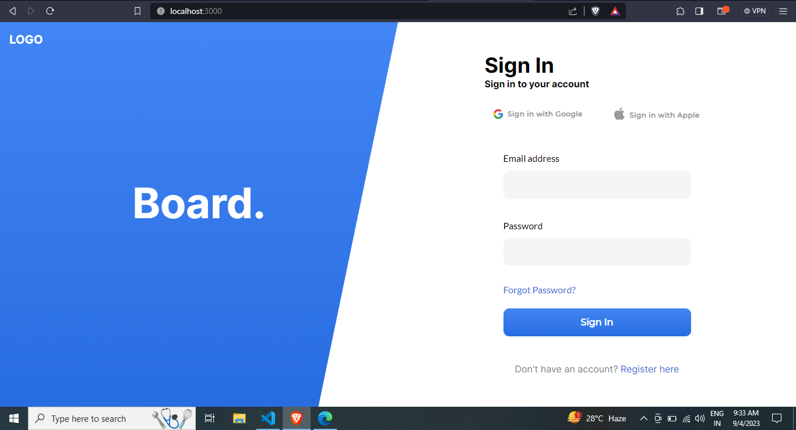
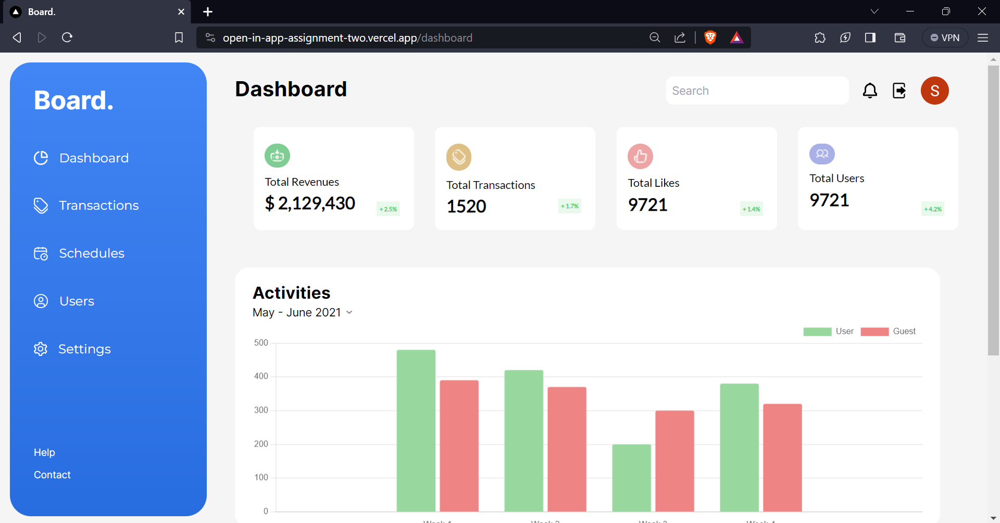
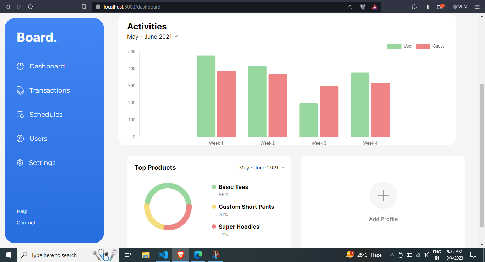
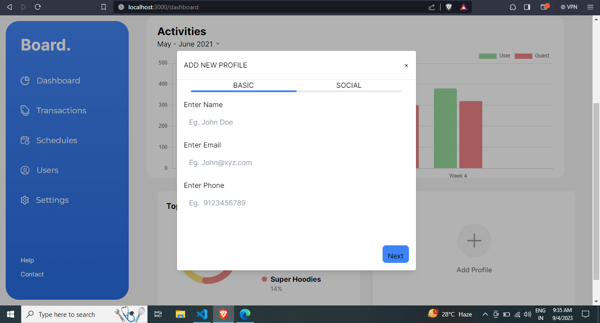
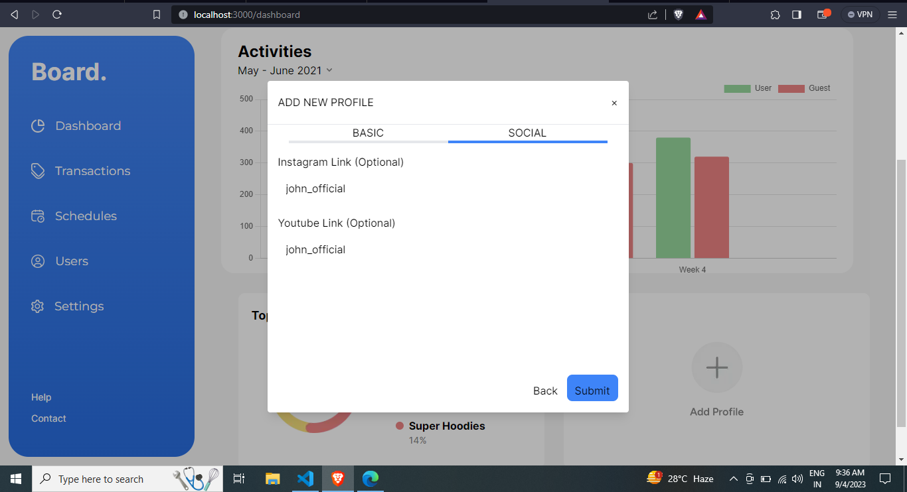
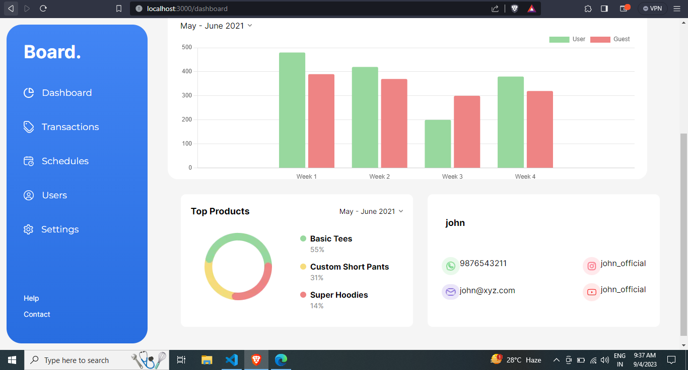

# OPEN_IN_APP

## Live Link

https://open-in-app-assignment-two.vercel.app/

## Video Preview


https://github.com/Srishti0901/OpenInApp-Assignment/assets/103064237/274addb2-805c-46c4-968d-d696643f252a


## Images








<hr/>

## Getting Started

First, run the development server:

```bash
npm run dev

Open [http://localhost:3000](http://localhost:3000) with your browser to see the result.
```
